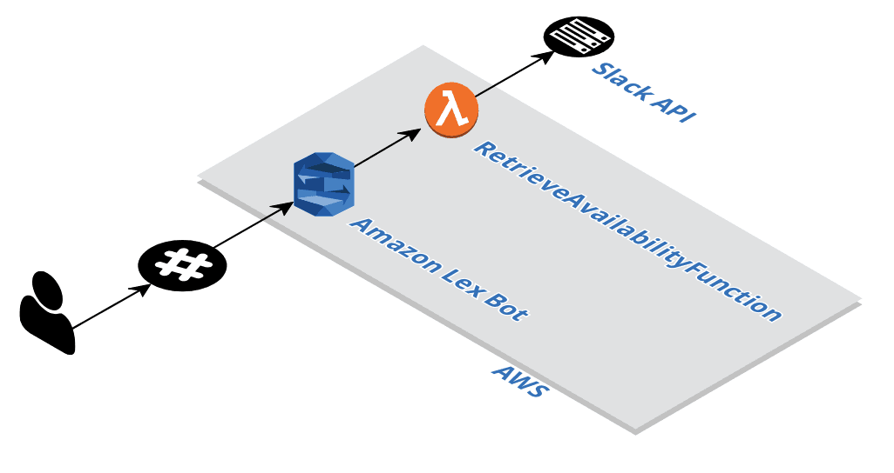

# Coordibot

[](https://travis-ci.org/jcperez/coordibot)
[](https://codecov.io/gh/jcperez/coordibot)

Coordibot is a AWS Lex based conversational bot written in Typescript that uses AWS Lambda functions to provide Google Calendar information back to callers.

## Application Overview



The application is an AWS Lex based bot, that interacts with a AWS Lambda functions.

## Setup

Clone the repository, and install the dependencies by running

```
$ npm install
```

The command-line TypeScript compiler can be installed as a Node.js package.

```
$ npm install -g typescript
```


Compile the Typescript application

```
$ tsc
```

### Environment variables

Setup the following environment variables

| Environment variable  | Description                                         | Default       |
|-----------------------|-----------------------------------------------------|---------------|
| INTERVIEWERS          | An array of strings                                 |               |
| GOOGLE_CONFIG         |                                                     |               |
| EVENT_NAME            | The event name that the application is looking for  |               |
| BOT_SLACK_HANDLER     | Slack handler of the bot                            | `@coordibot`  |
| SLACK_TOKEN           | Workplace's Slack token                             |               |
